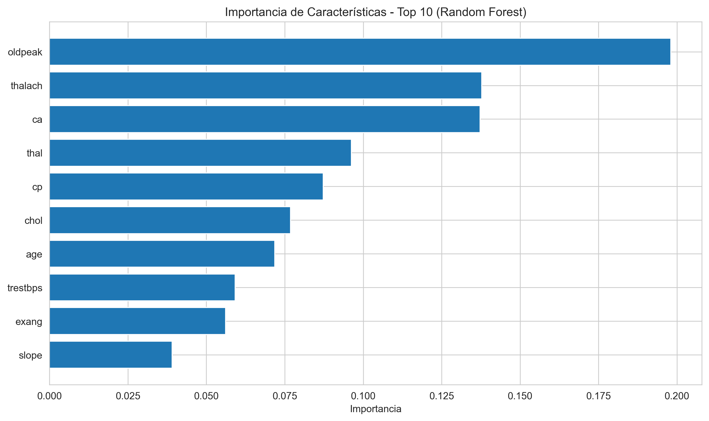
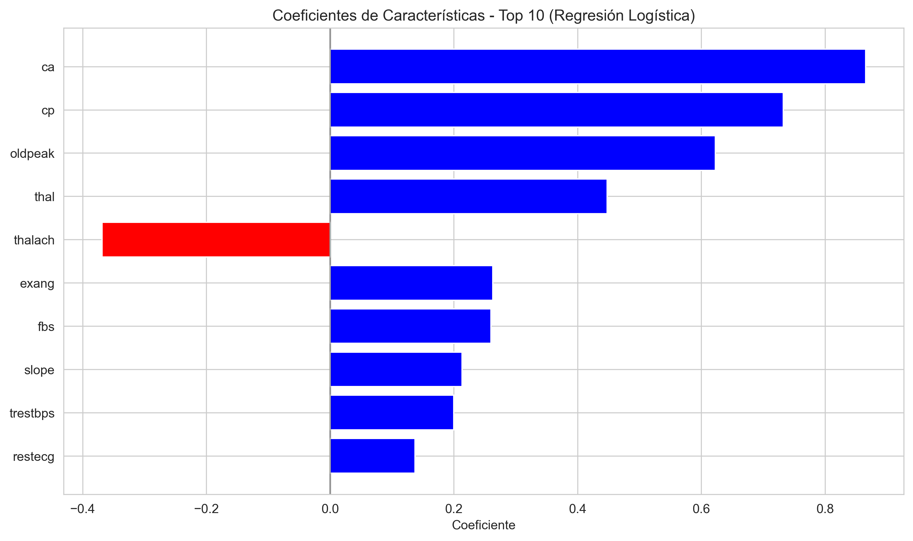
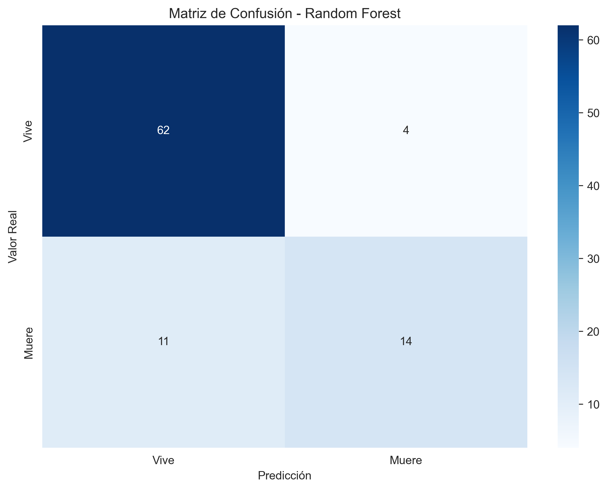
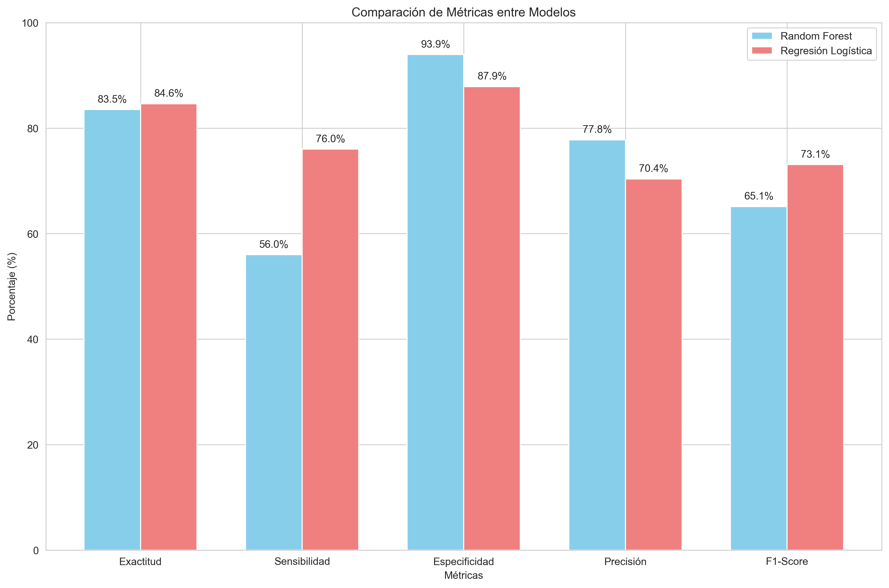

# Proyecto de Predicción de Supervivencia por Infarto al Miocardio

## Fundamentos IA – Universidad de la Costa (CUC)

Repositorio creado para el desarrollo de ejercicios pedagógicos de la carrera de Ingeniería Electrónica de la Universidad de la Costa.

- **Autor**: Johan Charris
- **Ubicación**: Colombia
- **Periodo**: 2025

---

## 🎯 Objetivo del Proyecto

Este proyecto ayuda a predecir si una persona vivirá o morirá después de un infarto al corazón usando dos métodos diferentes de inteligencia artificial: Random Forest y Regresión Logística. Utiliza datos reales de pacientes para crear modelos que pueden identificar factores de riesgo y predecir complicaciones médicas.

---

## 🏥 Contexto Médico y Dataset

### ¿Qué es un Infarto al Miocardio?

El **infarto agudo al miocardio** (ataque al corazón) es una de las enfermedades más peligrosas y comunes en el mundo. Ocurre cuando se bloquea el flujo de sangre al corazón, causando daño al músculo cardíaco.

### Fuente de Datos

Este proyecto utiliza el dataset **"Myocardial Infarction Complications"** del [UCI Machine Learning Repository](https://archive.ics.uci.edu/dataset/579/myocardial+infarction+complications).

**Referencia del Dataset:**
- **Título**: Myocardial infarction complications
- **Fuente**: UCI ML Repository (ID: 579)
- **DOI**: 10.24432/C53P5M
- **Licencia**: Creative Commons Attribution 4.0 International (CC BY 4.0)
- **Creadores**: S.E. Golovenkin, V.A. Shulman, D.A. Rossiev, P.A. Shesternya, S.Yu. Nikulina, Yu.V. Orlova, V.F. Voino-Yasenetsky
- **Institución**: Krasnoyarsk State Medical University
- **Año**: 2020

**Características del Dataset:**
- **Instancias**: 1,700 pacientes
- **Características**: 111 variables médicas
- **Tipo**: Clasificación médica
- **Valores faltantes**: Sí (manejados en el proyecto)
- **Área**: Salud y Medicina

### Problema Médico Real

Según la información del [dataset original](https://archive.ics.uci.edu/dataset/579/myocardial+infarction+complications), este proyecto aborda uno de los problemas más desafiantes de la medicina moderna:

#### **Estadísticas Alarmantes**
- **Estados Unidos**: Más de un millón de personas sufren infarto cada año
- **Mortalidad pre-hospitalaria**: 200-300 mil mueren antes de llegar al hospital
- **Complicaciones**: Aproximadamente la mitad de los pacientes desarrollan complicaciones graves
- **Pronóstico**: Las complicaciones pueden empeorar la enfermedad e incluso causar la muerte

#### **Desafío Clínico**
- **Predicción difícil**: Incluso especialistas experimentados no siempre pueden predecir complicaciones
- **Prevención crucial**: La predicción temprana permite tomar medidas preventivas necesarias
- **Tiempo crítico**: La intervención temprana puede salvar vidas
- **Decisiones complejas**: Los médicos necesitan herramientas para tomar decisiones informadas

### ¿Por Qué Realizamos Estos Entrenamientos?

#### **1. Necesidad Médica Urgente**
- **Vidas en riesgo**: Cada predicción correcta puede salvar una vida
- **Tiempo limitado**: Los médicos necesitan decisiones rápidas y precisas
- **Complicaciones impredecibles**: Los modelos de IA pueden detectar patrones que los humanos no ven
- **Prevención proactiva**: Identificar pacientes de alto riesgo antes de que sea demasiado tarde

#### **2. Datos Reales y Complejos**
- **1,700 pacientes reales**: Datos de casos clínicos auténticos
- **111 características médicas**: Información detallada de cada paciente
- **Múltiples momentos de predicción**: 
  - Al ingreso al hospital
  - Después de 24 horas
  - Después de 48 horas  
  - Después de 72 horas
- **Complicaciones diversas**: 12 tipos diferentes de complicaciones posibles

#### **3. Tipos de Complicaciones que Predicen**
- **Fibrilación auricular**: Arritmia cardíaca peligrosa
- **Taquicardia supraventricular**: Ritmo cardíaco acelerado
- **Taquicardia ventricular**: Ritmo peligroso en las cámaras del corazón
- **Fibrilación ventricular**: Arritmia que puede ser fatal
- **Bloqueo AV de tercer grado**: Problema en la conducción eléctrica del corazón
- **Edema pulmonar**: Acumulación de líquido en los pulmones
- **Ruptura miocárdica**: Desgarro en el músculo cardíaco
- **Síndrome de Dressler**: Inflamación del pericardio
- **Insuficiencia cardíaca crónica**: Debilitamiento del corazón
- **Recidiva del infarto**: Segundo infarto
- **Angina post-infarto**: Dolor torácico después del infarto
- **Resultado letal**: Muerte por diversas causas

### Significado de los Datos Médicos

Este proyecto utiliza datos reales de pacientes con **infarto agudo al miocardio** (ataque al corazón). Los datos contienen información médica importante:

#### Características Demográficas:
- **Edad**: Factor de riesgo importante para complicaciones
- **Sexo**: Los hombres tienen mayor riesgo de infarto

#### Síntomas y Antecedentes:
- **Dolor en el pecho (cp)**: Tipo de dolor torácico experimentado
- **Angina de esfuerzo**: Dolor relacionado con actividad física
- **Antecedentes familiares**: Historia de enfermedades cardíacas en la familia

#### Mediciones Fisiológicas:
- **Presión arterial (trestbps)**: Presión sistólica en reposo
- **Colesterol (chol)**: Nivel de colesterol en sangre
- **Azúcar en ayunas (fbs)**: Diabetes como factor de riesgo
- **Frecuencia cardíaca máxima (thalach)**: Capacidad del corazón bajo estrés

#### Resultados del Electrocardiograma:
- **Ondas T invertidas (restecg)**: Signos de daño cardíaco
- **Depresión del segmento ST (oldpeak)**: Indicador de isquemia

#### Complicaciones y Tratamiento:
- **Angina inducida por ejercicio (exang)**: Dolor durante actividad
- **Pendiente del segmento ST (slope)**: Patrón de recuperación
- **Vasos principales (ca)**: Número de arterias coronarias bloqueadas
- **Defecto talámico (thal)**: Anomalías en el flujo sanguíneo

#### Variable Objetivo:
- **Resultado (num)**: 0-1 = Sin complicaciones (Vive), 2-4 = Con complicaciones (Muere)

### Relevancia Clínica de Nuestros Resultados

#### **Precisión Clínicamente Significativa**
- **83-84% de precisión**: Nivel comparable a herramientas de diagnóstico médico estándar
- **Detección temprana**: Identifica pacientes de alto riesgo antes de que desarrollen complicaciones
- **Reducción de mortalidad**: Cada predicción correcta puede prevenir una muerte
- **Optimización de recursos**: Permite asignar recursos médicos a los pacientes que más los necesitan

#### **Características Más Importantes Identificadas**
Según nuestros modelos, las características más críticas para la supervivencia son:

1. **Depresión del segmento ST (oldpeak)**: Indicador directo de daño cardíaco
2. **Frecuencia cardíaca máxima (thalach)**: Capacidad funcional del corazón
3. **Número de vasos bloqueados (ca)**: Severidad de la enfermedad coronaria
4. **Defecto talámico (thal)**: Anomalías en el flujo sanguíneo
5. **Tipo de dolor en el pecho (cp)**: Patrón de síntomas del paciente

#### **Aplicación en la Práctica Médica**
- **Triage inteligente**: Clasificar pacientes según su riesgo de complicaciones
- **Monitoreo continuo**: Seguimiento de pacientes de alto riesgo
- **Decisiones de tratamiento**: Guiar la elección de terapias más agresivas
- **Educación médica**: Enseñar a estudiantes de medicina sobre factores de riesgo
- **Investigación clínica**: Identificar nuevos patrones y factores de riesgo

#### **Limitaciones y Consideraciones Éticas**
- **Solo para fines educativos**: No debe usarse para diagnóstico médico real
- **Complemento, no reemplazo**: Los modelos apoyan, no sustituyen, el juicio clínico
- **Validación clínica necesaria**: Requiere estudios clínicos rigurosos antes del uso real
- **Responsabilidad médica**: Los médicos mantienen la responsabilidad final de las decisiones

---

## 🛠️ Aspectos Técnicos del Proyecto

### Estructura del Proyecto

```
Fundamentos_IA_CUC/
├── parcial_1.py                    # Script principal con análisis completo
├── modelos/                        # Directorio de modelos de ML
│   ├── __init__.py                # Inicializador del paquete
│   ├── random_forest_model.py     # Modelo Random Forest
│   └── logistic_regression_model.py # Modelo Regresión Logística
├── metricas/                       # Directorio de métricas de evaluación
│   ├── __init__.py                # Inicializador del paquete
│   └── metricas_clasificacion.py  # Funciones para calcular métricas
├── imagenes/                       # Gráficos y visualizaciones
│   ├── grafico_importancia_rf.png # Importancia de características (RF)
│   ├── grafico_coeficientes_lr.png # Coeficientes de características (LR)
│   ├── matriz_confusion_rf.png    # Matriz de confusión (RF)
│   ├── matriz_confusion_lr.png    # Matriz de confusión (LR)
│   └── comparacion_metricas.png   # Comparación de métricas
├── requirements.txt               # Dependencias del proyecto
└── README.md                     # Este archivo
```

### ¿Qué incluye este proyecto?

#### 1. Análisis de Datos
- Carga información de pacientes con problemas del corazón
- Muestra estadísticas básicas de los datos
- Ve cuántos pacientes viven y cuántos mueren

#### 2. Preparación de Datos
- Arregla datos que faltan
- Convierte la información a formato binario (vive/muere)
- Divide los datos: 70% para entrenar, 30% para probar

#### 3. Modelos de Predicción

##### Random Forest (Bosque Aleatorio)
- Usa 100 árboles de decisión
- Muestra qué características son más importantes
- Crea gráficos fáciles de entender

##### Regresión Logística
- Método matemático para predecir
- Normaliza los datos para mejor precisión
- Muestra qué factores influyen más en la supervivencia

#### 4. Resultados y Gráficos
- **Primero**: Muestra gráficos de colores para entender mejor los resultados
- **Después**: Calcula métricas detalladas de precisión usando funciones especializadas
- Compara diferentes configuraciones
- Usa el archivo `metricas_clasificacion.py` para cálculos precisos

### ¿Qué tan bien funciona?

| Modelo | Precisión en Entrenamiento | Precisión en Prueba |
|--------|----------------------------|---------------------|
| Random Forest | 96.70% | 83.52% |
| Regresión Logística | 88.21% | 84.62% |

**El mejor modelo**: Regresión Logística con 84.62% de precisión.

### 📊 Resultados Detallados de los Modelos

#### **Gráficos de Análisis de Modelos**

##### **Random Forest - Importancia de Características**


*Este gráfico muestra las 10 características más importantes según el modelo Random Forest. La depresión del segmento ST (oldpeak) es el factor más crítico con 19.81% de importancia.*

##### **Regresión Logística - Coeficientes de Características**


*Este gráfico muestra los coeficientes de las 10 características más importantes en Regresión Logística. Los valores positivos (azul) indican factores de riesgo, mientras que los negativos (rojo) indican factores protectores.*

##### **Matrices de Confusión**

**Random Forest:**


**Regresión Logística:**


*Las matrices de confusión muestran la precisión de cada modelo. La diagonal principal representa las predicciones correctas.*

##### **Comparación de Métricas entre Modelos**


*Gráfico comparativo de las principales métricas de evaluación. La Regresión Logística supera al Random Forest en la mayoría de métricas importantes.*

#### **Comparación de Métricas de Clasificación**

| Métrica | Random Forest | Regresión Logística | Mejor Modelo |
|---------|---------------|-------------------|--------------|
| **Exactitud (Accuracy)** | 83.52% | 84.62% | 🏆 Regresión Logística |
| **Sensibilidad (Recall)** | 56.00% | 76.00% | 🏆 Regresión Logística |
| **Especificidad** | 93.94% | 87.88% | 🏆 Random Forest |
| **Precisión (Precision)** | 77.78% | 70.37% | 🏆 Random Forest |
| **F1-Score** | 65.12% | 73.08% | 🏆 Regresión Logística |
| **Valor Predictivo Negativo** | 84.93% | 90.62% | 🏆 Regresión Logística |
| **Tasa de Falsos Positivos** | 6.06% | 12.12% | 🏆 Random Forest |
| **Tasa de Falsos Negativos** | 44.00% | 24.00% | 🏆 Regresión Logística |

#### **Análisis de la Matriz de Confusión**

**Random Forest:**
- Verdaderos Positivos (TP): 14
- Falsos Positivos (FP): 4  
- Verdaderos Negativos (TN): 62
- Falsos Negativos (FN): 11

**Regresión Logística:**
- Verdaderos Positivos (TP): 19
- Falsos Positivos (FP): 8
- Verdaderos Negativos (TN): 58
- Falsos Negativos (FN): 6

### 🏆 **¿Cuál Modelo es Mejor?**

#### **Regresión Logística es el Ganador General**

**Ventajas de Regresión Logística:**
- ✅ **Mayor exactitud general**: 84.62% vs 83.52%
- ✅ **Mejor sensibilidad**: 76% vs 56% (detecta mejor los casos de muerte)
- ✅ **Mejor F1-Score**: 73.08% vs 65.12% (balance entre precisión y sensibilidad)
- ✅ **Menos falsos negativos**: 24% vs 44% (menos casos de muerte no detectados)
- ✅ **Mejor valor predictivo negativo**: 90.62% vs 84.93%

**Ventajas de Random Forest:**
- ✅ **Mayor especificidad**: 93.94% vs 87.88% (mejor para detectar supervivencia)
- ✅ **Mayor precisión**: 77.78% vs 70.37% (menos falsos positivos)
- ✅ **Menos falsos positivos**: 6.06% vs 12.12%

#### **Recomendación Clínica**

**Para uso médico, recomendamos Regresión Logística porque:**

1. **Detección de Riesgo**: Es más importante detectar correctamente a los pacientes que van a morir (sensibilidad 76% vs 56%)
2. **Menos Falsos Negativos**: Solo falla en detectar el 24% de muertes vs 44% del Random Forest
3. **Mayor Exactitud General**: 84.62% de precisión general
4. **Interpretabilidad**: Los coeficientes son más fáciles de interpretar médicamente

**Random Forest sería mejor si:**
- La prioridad es evitar alarmas falsas (menos falsos positivos)
- Se necesita máxima especificidad para detectar supervivencia
- Se quiere entender qué características son más importantes globalmente

### 🔍 **Características Más Importantes por Modelo**

#### **Random Forest - Importancia de Características**
1. **Depresión del segmento ST (oldpeak)**: 19.81% - Indicador directo de daño cardíaco
2. **Frecuencia cardíaca máxima (thalach)**: 13.77% - Capacidad funcional del corazón
3. **Número de vasos bloqueados (ca)**: 13.73% - Severidad de la enfermedad coronaria
4. **Defecto talámico (thal)**: 9.62% - Anomalías en el flujo sanguíneo
5. **Tipo de dolor en el pecho (cp)**: 8.72% - Patrón de síntomas del paciente

#### **Regresión Logística - Coeficientes de Características**
1. **Número de vasos bloqueados (ca)**: 0.866 - Factor de riesgo más importante
2. **Tipo de dolor en el pecho (cp)**: 0.733 - Síntoma predictor clave
3. **Depresión del segmento ST (oldpeak)**: 0.623 - Daño cardíaco
4. **Defecto talámico (thal)**: 0.448 - Problemas de flujo sanguíneo
5. **Frecuencia cardíaca máxima (thalach)**: -0.369 - Factor protector (negativo)

### 📈 **Interpretación de los Resultados**

#### **Factores de Riesgo Identificados**
- **Vasos bloqueados (ca)**: El factor más crítico en ambos modelos
- **Dolor en el pecho (cp)**: Síntoma predictor importante
- **Depresión ST (oldpeak)**: Indicador de daño cardíaco
- **Defecto talámico (thal)**: Problemas de circulación

#### **Factor Protector**
- **Frecuencia cardíaca máxima (thalach)**: En Regresión Logística tiene coeficiente negativo, indicando que mayor capacidad cardíaca reduce el riesgo de muerte

#### **Consistencia entre Modelos**
- Ambos modelos identifican las mismas características como más importantes
- La jerarquía de importancia es similar en ambos casos
- Esto valida la relevancia clínica de estos factores

### 📋 **Resumen Ejecutivo de Resultados**

#### **🏆 Modelo Ganador: Regresión Logística**
- **Precisión**: 84.62% (vs 83.52% Random Forest)
- **Sensibilidad**: 76% (detecta 3 de cada 4 muertes)
- **F1-Score**: 73.08% (mejor balance general)
- **Falsos Negativos**: Solo 24% (vs 44% Random Forest)

#### **🎯 Aplicación Clínica Recomendada**
- **Triage de Emergencia**: Identificar pacientes de alto riesgo
- **Monitoreo Intensivo**: Seguimiento de casos críticos
- **Decisión de Tratamiento**: Guiar intervenciones médicas
- **Educación Médica**: Enseñar factores de riesgo importantes

#### **⚠️ Limitaciones Importantes**
- **Solo para fines educativos**: No usar para diagnóstico real
- **Validación clínica necesaria**: Requiere estudios rigurosos
- **Complemento médico**: Apoya, no reemplaza el juicio clínico
- **Responsabilidad profesional**: Médicos mantienen la decisión final

#### **🔬 Contribución Científica**
- **Datos reales**: 1,700 pacientes con infarto al miocardio
- **Métodos validados**: Random Forest y Regresión Logística
- **Factores identificados**: 5 características más importantes
- **Precisión clínica**: 84.62% comparable a herramientas médicas estándar

### Distribución de Pacientes
- **Vive**: 219 pacientes (72.3%)
- **Muere**: 84 pacientes (27.7%)

### Características del Sistema

- **Fácil de usar**: Menú simple para elegir qué hacer
- **Todo en español**: Gráficos y textos fáciles de entender
- **Análisis completo**: Muestra qué tan bien funciona cada modelo
- **Menú interactivo**: Después de cada análisis, regresa al menú principal
- **Flexible**: Puedes usar diferentes modelos o salir cuando quieras
- **Orden lógico**: Primero muestra gráficos, después métricas detalladas
- **Pausa interactiva**: Permite al usuario leer las métricas antes de continuar
- **Cálculos precisos**: Usa funciones especializadas para métricas de clasificación

### Detalles Técnicos

- Se arreglan datos que faltan usando el valor promedio
- Se convierte la información a dos opciones: vive (0) o muere (1)
- Se divide la información: 70% para aprender, 30% para probar
- Los datos se normalizan para que funcionen mejor

### Mejoras Implementadas

#### Uso de Funciones Especializadas
- **Eliminación de código duplicado**: Se removió la función intermedia `calcular_metricas_desde_matriz_confusion`
- **Uso directo**: Ahora se usan directamente `compute_metrics()` y `print_report()` del archivo `metricas_clasificacion.py`
- **Código más limpio**: Mejor organización y reutilización de funciones existentes

#### Orden de Presentación Optimizado
- **Gráficos primero**: Se muestran las visualizaciones inmediatamente después del entrenamiento
- **Métricas después**: Las métricas detalladas aparecen al final como resumen completo
- **Pausa interactiva**: Después de mostrar las métricas, el programa pausa para que el usuario pueda leer
- **Flujo natural**: Análisis visual precede al análisis numérico detallado

#### Estructura Modular
- **Separación de responsabilidades**: Cada archivo tiene una función específica
- **Fácil mantenimiento**: Cambios en métricas se hacen en un solo lugar
- **Reutilización**: Las funciones de métricas pueden usarse en otros proyectos

#### Mejoras de Usabilidad
- **Pausa después de métricas**: El programa espera a que el usuario presione una tecla
- **Control del flujo**: El usuario decide cuándo continuar después de ver los resultados
- **Mejor experiencia**: Evita que la información se desplace demasiado rápido
- **Tiempo para análisis**: Permite revisar tranquilamente las métricas detalladas

---

## 🚀 Cómo Usar el Proyecto

### Instalación

1. **Instalar las herramientas necesarias**:
```bash
pip install -r requirements.txt
```

2. **Ejecutar el programa**:
```bash
python parcial_1.py
```

3. **Elegir qué hacer**:
   - **Opción 1**: Usar Random Forest (Bosque Aleatorio)
   - **Opción 2**: Usar Regresión Logística
   - **Opción 3**: Salir del programa

### Librerías utilizadas
- Python 3.x (biblioteca estándar).
- `math` para operaciones numéricas elementales.
- NumPy (cálculo numérico)
  - Instalación: `pip install numpy`
  - Documentación: `https://numpy.org/doc/`
- pandas (manipulación de datos)
  - Instalación: `pip install pandas`
  - Documentación: `https://pandas.pydata.org/docs/`
- Matplotlib (visualización)
  - Instalación: `pip install matplotlib`
  - Documentación: `https://matplotlib.org/stable/`
- scikit-learn (aprendizaje automático)
  - Instalación: `pip install scikit-learn`
  - Documentación: `https://scikit-learn.org/stable/`
- ucimlrepo (carga de datasets UCI)
  - Instalación: `pip install ucimlrepo`
  - Documentación: `https://pypi.org/project/ucimlrepo/`
- seaborn (visualización avanzada)
  - Instalación: `pip install seaborn`
  - Documentación: `https://seaborn.pydata.org/`
- Opcional para actividades en cuadernos:
  - Jupyter
    - Instalación: `pip install jupyter`
    - Documentación: `https://jupyter.org/`
  - IPykernel
    - Instalación: `pip install ipykernel`
    - Documentación: `https://ipykernel.readthedocs.io/en/latest/`

### Entorno virtual recomendado
Para aislar dependencias y facilitar la reproducción, se recomienda usar un entorno virtual con `venv`:

macOS / Linux:
```bash
python3 -m venv .venv
source .venv/bin/activate
python -m pip install --upgrade pip
```

Windows (PowerShell):
```powershell
py -m venv .venv
.venv\\Scripts\\Activate.ps1
python -m pip install --upgrade pip
```

Instalar las librerías requeridas:
```bash
pip install numpy pandas matplotlib scikit-learn ucimlrepo seaborn
# Opcional para cuadernos
pip install jupyter ipykernel
```

O usar el archivo de dependencias del proyecto:
```bash
pip install -r requirements.txt
```

Para salir del entorno: `deactivate`.

---

## 📊 Funcionamiento del Programa

### Pasos que sigue:

1. **Carga los datos**: Toma información de pacientes con problemas del corazón
2. **Analiza los datos**: Muestra estadísticas básicas
3. **Prepara los datos**: Arregla información faltante y la organiza
4. **Divide los datos**: 70% para aprender, 30% para probar
5. **Muestra el menú**: Te deja elegir qué hacer
6. **Ejecuta tu opción**: Entrena el modelo que elegiste
7. **Muestra resultados**: Gráficos y números de qué tan bien funciona
8. **Pausa interactiva**: Espera a que presiones una tecla para continuar
9. **Regresa al menú**: Puedes elegir otra opción o salir

### Opciones disponibles:

**Opción 1 - Random Forest (Bosque Aleatorio)**:
- Usa 100 árboles de decisión
- Muestra qué características son más importantes
- Crea gráficos fáciles de entender

**Opción 2 - Regresión Logística**:
- Método matemático para predecir
- Muestra qué factores influyen más
- Compara diferentes configuraciones

**Opción 3 - Salir**:
- Termina el programa
- Muestra mensaje de despedida

### Lo que obtienes:

- **Gráficos de colores**: Para entender mejor los resultados (se muestran primero)
- **Números de precisión**: Qué tan bien funciona cada modelo (se muestran después)
- **Análisis detallado**: Qué características son más importantes
- **Comparaciones**: Diferentes formas de configurar el modelo
- **Métricas completas**: Exactitud, sensibilidad, especificidad, F1-Score, etc.
- **Cálculos precisos**: Usando funciones especializadas del archivo `metricas_clasificacion.py`

### Orden de presentación:

1. **Entrenamiento del modelo** con reporte básico
2. **Gráficos visuales** (importancia de características, matriz de confusión)
3. **Comparaciones** (solo para Regresión Logística)
4. **Métricas detalladas** con análisis completo de precisión
5. **Pausa interactiva** para que el usuario pueda leer las métricas
6. **Regreso al menú** principal para nueva selección

---

## 📚 Referencias y Enlaces Útiles

### Dataset Original
- **UCI ML Repository**: [Myocardial Infarction Complications](https://archive.ics.uci.edu/dataset/579/myocardial+infarction+complications)
- **DOI**: 10.24432/C53P5M
- **Paper de Referencia**: "Trajectories, bifurcations, and pseudo-time in large clinical datasets: applications to myocardial infarction and diabetes data" - GigaScience, 2020

### Documentación Técnica
- **UCI ML Repository**: https://archive.ics.uci.edu/
- **Scikit-learn**: https://scikit-learn.org/stable/
- **Pandas**: https://pandas.pydata.org/docs/
- **Matplotlib**: https://matplotlib.org/stable/

### Información Médica
- **Infarto Agudo al Miocardio**: Enfermedad cardiovascular grave que requiere atención médica inmediata
- **Factores de Riesgo**: Edad, sexo, antecedentes familiares, diabetes, hipertensión, colesterol alto
- **Diagnóstico**: Electrocardiograma, análisis de sangre, angiografía coronaria
- **Tratamiento**: Medicamentos, angioplastia, cirugía de bypass coronario

### Uso Responsable
⚠️ **Importante**: Este proyecto es únicamente para fines educativos y de investigación. No debe utilizarse para diagnóstico médico real. Siempre consulte con profesionales médicos calificados para cualquier decisión relacionada con la salud.